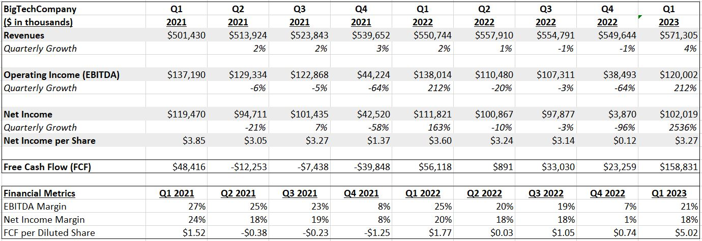
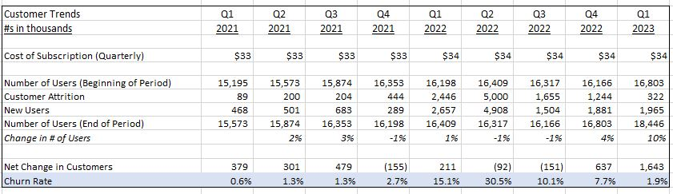
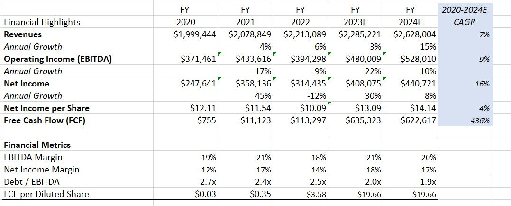

#  Financial Analysis Practice - Investment Banking (New York Jobs CEO Council)

## Task 1 
### Background information
Your vice president sends you an Excel template containing BigTechCompany's quarterly financial statements and a PowerPoint template to complete. Your task is to prepare tables on the company's financials and to present your analysis in a PowerPoint presentation. 

 **Financial metrics** :  revenue, operating income (EBITDA), net income, and free cash flow, EBITDA margin and debt/EBITDA.  

**Result**: What trends do you see in the company's financials? Is the company stable, or is it in decline? Are there any red flags that would make this company high risk? 

**Guide**: Your bank wants to avoid companies with negative free cash flow and unhealthy leverage ratios.

---
### Key Terms: 

* Financial statements: A company's core financial statements are the income statement, balance sheet, and statement of cash flows.
* Revenue: The money earned by a company in exchange for providing goods and services.
* Operating income (EBITDA): The amount of profit a company makes from its operations. This is calculated by subtracting operating expenses from revenue. EBITDA stands for “earnings before interest, taxes, depreciation, and amortization.”
* Net income: A company's earnings after paying operating expenses, taxes, and interest.
Free cash flow: The amount of cash a company has available to pay its debtors and/or its equity shareholders. 
* EBITDA margin: A metric of a company's profitability. This is calculated by dividing a company's operating income (a.k.a. EBITDA) by revenue. 
* Debt/EBITDA: A metric of a company's leverage. This is calculated by dividing a company's debt by its EBITDA. 
* Leverage ratios: Metrics that provide insight into a company's debt relative to its earnings. A company with high leverage ratios may run into difficulty with making debt payments.  
---
### Task instructions - Financial analysis

* Output 1:  Calculate the key financial indicators and financial metrics
 
* Output 2: The churn rate / subscribtion

* Output 3: Forcasting and CAGR

### Task presentation 
[Presentation Slide](./Task%201_BigTech%20Financial%20Analysis.pptx)